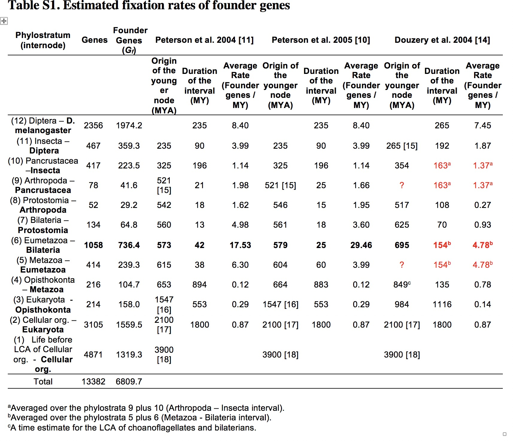
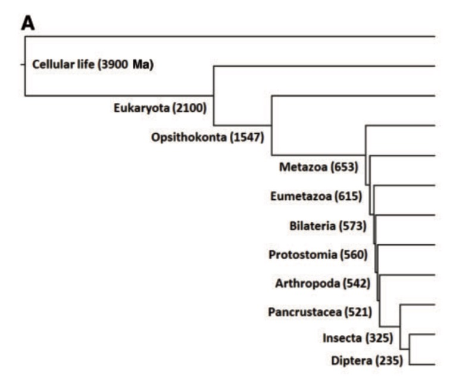
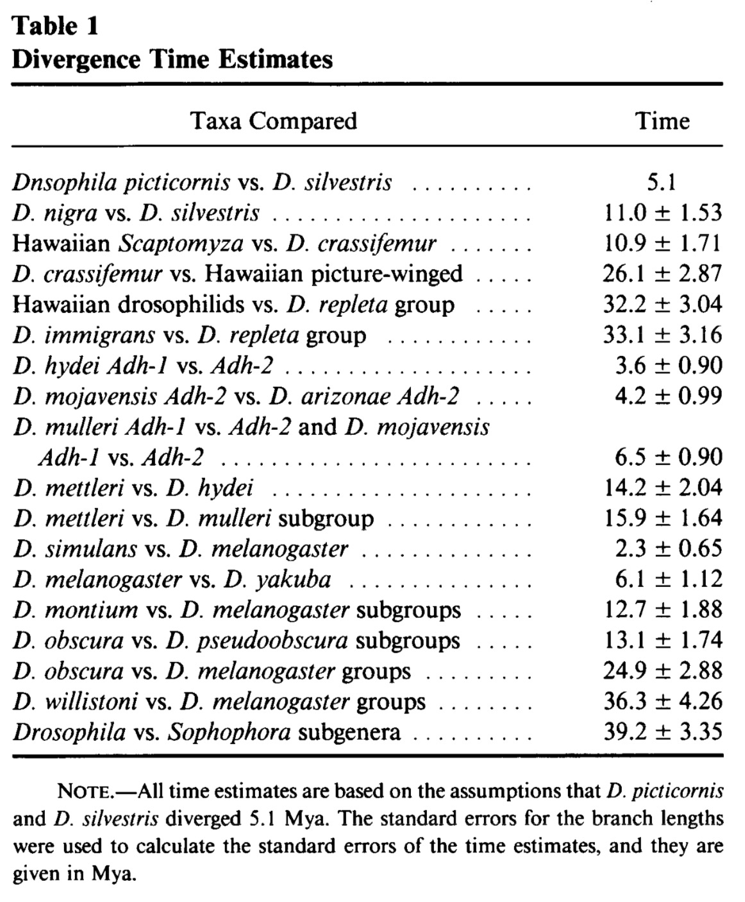

```{r setup, include=FALSE}
knitr::opts_chunk$set(echo = TRUE,message = F,warning = F,
                      cache = F)
```

## 2010, Age-dependent chromosomal distribution of male-biased genes in Drosophila

Zhang, Yong E., et al. "Age-dependent chromosomal distribution of male-biased genes in Drosophila." Genome research 20.11 (2010): 1526-1533.

Raw data could be downloaded from https://genome.cshlp.org/content/20/11/1526/suppl/DC1 ,
[Supp Tables.xls](https://genome.cshlp.org/content/suppl/2010/08/27/gr.107334.110.DC1/SupplementalTables.xls)

```{r}
library(readxl);library(Matrix)
library(ggplot2)
library(gridExtra);library(grid)
library(tidyverse);library(RColorBrewer)
library(AnnotationDbi);library(GO.db)
library(org.Dm.eg.db,verbose=F,quietly=T)

dir.create('2010_data',showWarnings = FALSE)
if(!file.exists('./2010_data/SupplementalTables.xls')){
  download.file(url = "https://genome.cshlp.org/content/suppl/2010/08/27/gr.107334.110.DC1/SupplementalTables.xls", 
              destfile = '2010_data/SupplementalTables.xls')
}
# read in gene age result
df<-read_excel('./2010_data/SupplementalTables.xls',sheet='S1',skip=1)
head(df)
dim(df)
length(unique(df$id))  #12856 fly genes

## map gene id to SYMBOL 
df1<-AnnotationDbi::select(org.Dm.eg.db,keys=df$id,
            keytype="FLYBASECG",c("FLYBASE","SYMBOL","GENENAME"))
dim(df);dim(df1)
sum(is.na(df1$FLYBASE)) # 961 NA
df1=df1[!is.na(df1$FLYBASE),]
dim(df1)
length(unique(df1$FLYBASE)) # 11895 unique hits

df2<-merge(df,df1,by.x='id',by.y='FLYBASECG')
dim(df2) # 11895    11
table(df2$branch) #it only contains 6 phylostratra
```


## 2017, No Evidence for Phylostratigraphic Bias Impacting Inferences on Patterns of Gene Emergence and Evolution

Domazet-Lošo, Tomislav, et al. "No evidence for phylostratigraphic bias impacting inferences on patterns of gene emergence and evolution." Molecular biology and evolution 34.4 (2017): 843-856.

Raw data could be downloaded from: https://academic.oup.com/mbe/article/34/4/843/2897203#63710950

I downloaded to `msw284_Supp' folder.

To get estimated divergence time of each phylostratrum, I collected some papers in the `ref_papers` folder:

- TableS1 from 2007-A phylostratigraphy approach to uncover the genomic history of major adaptations in metazoan lineages-supp
- Fig3A from 2014-Phylostratigraphic Bias Creates Spurious Patterns of Genome Evolution
- Table1 From 1995 Nei: The D. obscura and D. melanogaster groups apparently diverged about 25 Mya. Nei, 1995, Table1, 2.3mya, D. simulans vs. D. melanogaster

{width=50%}

{width=50%}

{width=50%}


Code below shows how to plot #gene in each phylostratrum based on these downloaded excel files.

```{r}
div.times=c(25,235,325,521,542,560,573,615,653,1547,2100,3900);
length(div.times)

# read in data and get gene.id for each protein.id
df2017<-read_excel('./msw284_Supp/TableS1.xlsx',sheet='Dmel_updated_phylostratigraphy',skip=3)
dim(df2017) #13794     4
head(df2017)
table(df2017$phylostrata)
barplot(table(df2017$phylostrata))
barplot(table(df2017$phylostrata)/nrow(df2017))


# this data contain protein ids
# check the overlap genes between fly  prot_id in 2017.dataset and fly.prot from org.Dm.eg.db.
columns(org.Dm.eg.db)
fly.prot<-keys(org.Dm.eg.db, keytype='FLYBASEPROT')
length(fly.prot) #30563
sum(df2017$prot_id %in% fly.prot) #13681 overlap genes

# get flybase ID for each fly prot_id
df.fly.prot<-AnnotationDbi::select(org.Dm.eg.db,
                                   keys=df2017$prot_id,
                                   keytype="FLYBASEPROT",c("FLYBASECG","FLYBASE",'SYMBOL',"GENENAME"))
dim(df.fly.prot) #13794     5
sum(is.na(df.fly.prot$SYMBOL)) #113, equals 13794-13681

gene.age=merge(df.fly.prot,df2017,by.x='FLYBASEPROT',by.y='prot_id')
dim(gene.age) #13794
table(gene.age$phylostrata)
sum(is.na(gene.age$FLYBASE)) #140 genes without FLYBASE id.
sum(table(gene.age$phylostrata)) #13794 genes can be used

gene.age2=gene.age[!is.na(gene.age$FLYBASE),]
dim(gene.age2) #13681 genes
#tmp=data.frame(table(gene.age$phylostrata)) #all 13794 gene in df2017
tmp=data.frame(table(gene.age2$phylostrata)); sum(tmp$ngene);#13681 overlapped genes

colnames(tmp)=c('phylostrata','ngene')
head(tmp)
my.txt=paste0(tmp$ngene,'\n',rev(div.times),'mya')
p1<-ggplot(tmp,aes(x=phylostrata,y=ngene))+
  geom_bar(stat='identity',fill='white',col='darkblue',width=1)+
  ylim(0,8000)+
  #geom_text(aes(label=ngene),vjust=-1)
  geom_text(aes(label=my.txt),vjust=-0.5)
  

my_theme<-theme_bw(base_size = 14)+
  theme(panel.grid.major = element_blank(),
        panel.grid.minor = element_blank(),
        panel.border = element_blank(),
        axis.ticks = element_blank(),
        axis.text.x = element_text(vjust = 6), 
        axis.title.x  = element_text(vjust = 5), 
        axis.text.y =  element_blank())
p1+my_theme

unique(df2017$phylostrata_name)
x=df2017[!duplicated(df2017$phylostrata_name),]
x[x$phylostrata_name=='cellular_organisms',]$phylostrata_name='CellLife'

x$phylostrata_name=factor(x$phylostrata_name,x$phylostrata_name)
head(x)
p2=ggplot(x,aes(x=phylostrata_name,y=phylostrata))+
    geom_bar(stat='identity',width=1,fill='white',col='black')+
    ylim(0,max(x$phylostrata+5))+
    geom_text(label=x$phylostrata_name,vjust=-1,hjust=0.5)

p2+my_theme+theme(axis.text.x = element_text(angle=45,vjust=1.5,hjust = 1))
    
pdf('./plot-phylostrata.pdf',width = 14)
grid.arrange(p1+my_theme,p2+my_theme,nrow=2)
dev.off()
```

## 2015, Evidence for Active Maintenance of Phylotranscriptomic Hourglass Patterns in Animal and Plant Embryogenesis

Drost, Hajk-Georg, et al. "Evidence for active maintenance of phylotranscriptomic hourglass patterns in animal and plant embryogenesis." Molecular biology and evolution 32.5 (2015): 1221-1231.

Raw data could be downloaded from [figshare](https://figshare.com/search?q=:keyword:%20%22Evidence%20for%20active%20maintenance%20of%20phylotranscriptomic%20hourglass%20patterns%20in%20animal%20and%20plant%20embryogenesis%22), [sUP]Supplementary table S3: Gene expression values used for TAI computations for all three species](https://figshare.com/articles/dataset/Supplementary_table_S3/1244948)

```{r}
# read in data and get gene.id for each protein.id
df2015<-read_excel('./2015_data/SupplementarytableS3.xls',sheet='Drosophila melanogaster')
dim(df2015) #12043     14

head(df2015)
table(df2015$Phylostratum)
barplot(table(df2015$Phylostratum))
barplot(table(df2015$Phylostratum)/nrow(df2015))


# this data contain protein ids
# check the overlap genes between fly  prot_id in 2017.dataset and fly.prot from org.Dm.eg.db.
columns(org.Dm.eg.db)
fly.prot<-keys(org.Dm.eg.db, keytype='FLYBASEPROT')
length(fly.prot) #30719
df2015$GeneID=gsub('fb','FB',df2015$GeneID)
sum(df2015$GeneID %in% fly.prot) #11795 overlap genes

# get flybase ID for each fly prot_id
df.fly.prot<-AnnotationDbi::select(org.Dm.eg.db,
                                   keys=df2015$GeneID,
                                   keytype="FLYBASEPROT",c("FLYBASECG","FLYBASE",'SYMBOL',"GENENAME"))
dim(df.fly.prot) #12043     5
sum(is.na(df.fly.prot$SYMBOL)) #248, equals 12043-11795

gene.age=merge(df.fly.prot,df2015,by.x='FLYBASEPROT',by.y='GeneID')
dim(gene.age) #12043
table(gene.age$phylostrata)
sum(is.na(gene.age$FLYBASE)) #248 genes without FLYBASE id.
sum(table(gene.age$Phylostratum)) #12043 genes can be used

gene.age2=gene.age[!is.na(gene.age$FLYBASE),]
dim(gene.age2) #11795 genes
#tmp=data.frame(table(gene.age$Phylostratum)) #all 12043 gene in df2015
tmp=data.frame(table(gene.age2$Phylostratum)); sum(tmp$Freq);#11795 overlapped genes

colnames(tmp)=c('phylostrata','ngene')
head(tmp)
age.name=c('cell','Eukaryota','Opisthokonta','Metazoa','Eumetazoa','Bilateria','Protostomia',
           'Arthropoda','Pancrustacea','Insecta','Endopterygota','Diptera','Drosophila');
tmp$age=factor(age.name,levels=age.name)
p1<-ggplot(tmp,aes(x=age,y=ngene))+
  geom_bar(stat='identity',fill='white',col='darkblue',width=1)+
  ylim(0,8000)+geom_text(label=tmp$ngene,vjust=-2)
  

my_theme<-theme_bw(base_size = 14)+
  theme(panel.grid.major = element_blank(),
        panel.grid.minor = element_blank(),
        panel.border = element_blank(),
        axis.ticks = element_blank(),
        axis.text.x = element_text(vjust = 1,angle = 45,hjust=1), 
        axis.title.x  = element_text(vjust = 5), 
        axis.text.y =  element_blank())
p1+my_theme
```
