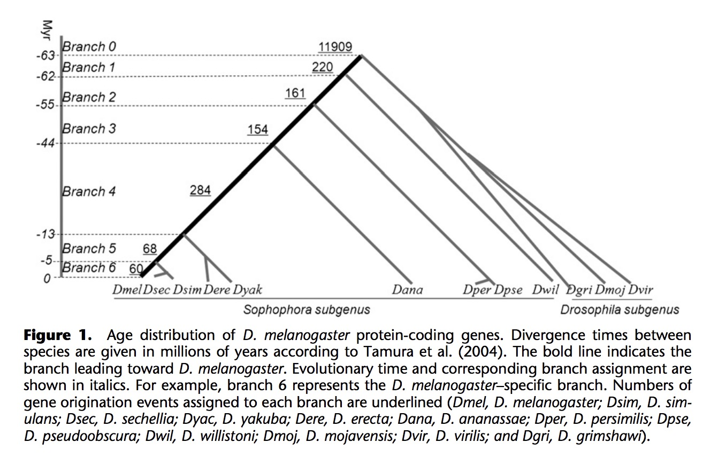
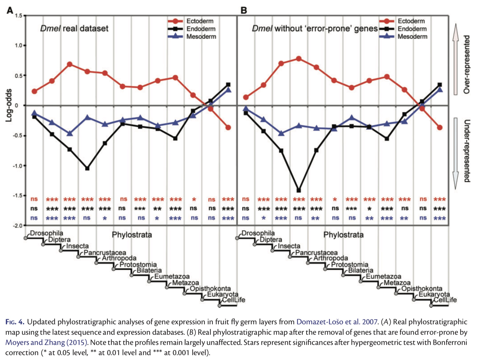
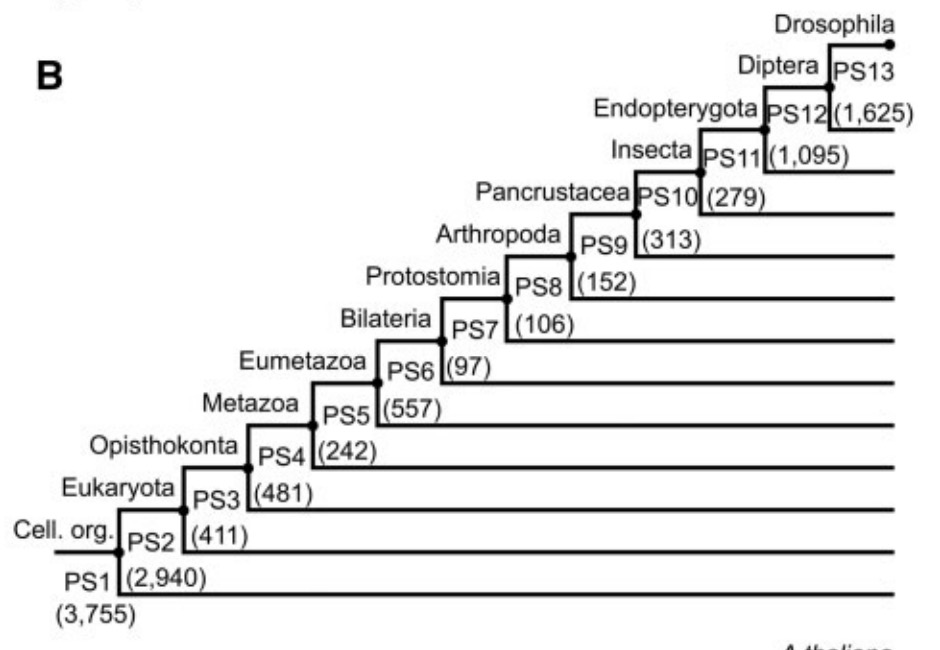

## phylostratigraphy

The goal of phylostratigraphy is to infer the evolutionary origin of each gene in an organism. This is done by searching for homologs within increasingly broad clades. The deepest clade that contains a homolog of the protein(s) encoded by a gene is that gene’s phylostratum.

For fly genes, there have been some publications inferring gene age following this approach:

- 2010 [Age-dependent chromosomal distribution of male-biased genes in Drosophila](https://genome.cshlp.org/content/20/11/1526.long)

- 2017 [No Evidence for Phylostratigraphic Bias Impacting Inferences on Patterns of Gene Emergence and Evolution](https://academic.oup.com/mbe/article/34/4/843/2897203)

- 2015 [Evidence for Active Maintenance of Phylotranscriptomic Hourglass Patterns in Animal and Plant Embryogenesis](https://academic.oup.com/mbe/article/32/5/1221/1125964)

Check out the `Phylostratigraphy_fly.gene_age.Rmd` or [Phylostratigraphy_fly.gene_age](http://htmlpreview.github.io/?https://github.com/mingwhy/bioinfo_homemade_tools/blob/main/Phylostratigraphy_fly.gene_age/Phylostratigraphy_fly.gene_age.html) for detailed information.

2010 paper contain 6 branches:

2017 paper contain 12 branches:

2015 paper contain 13 branches:

