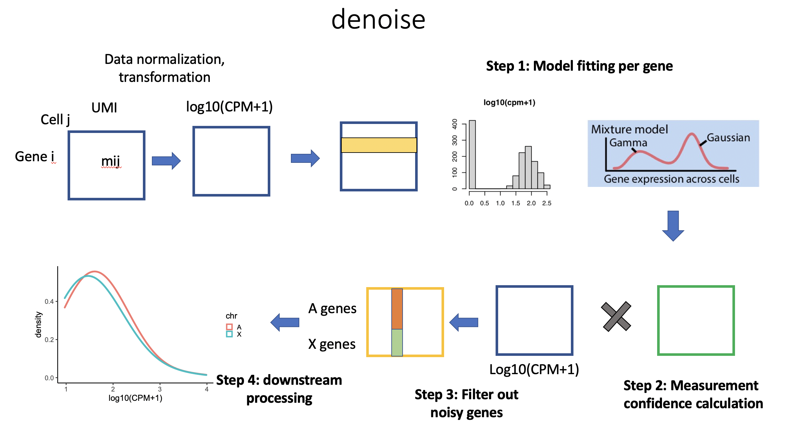
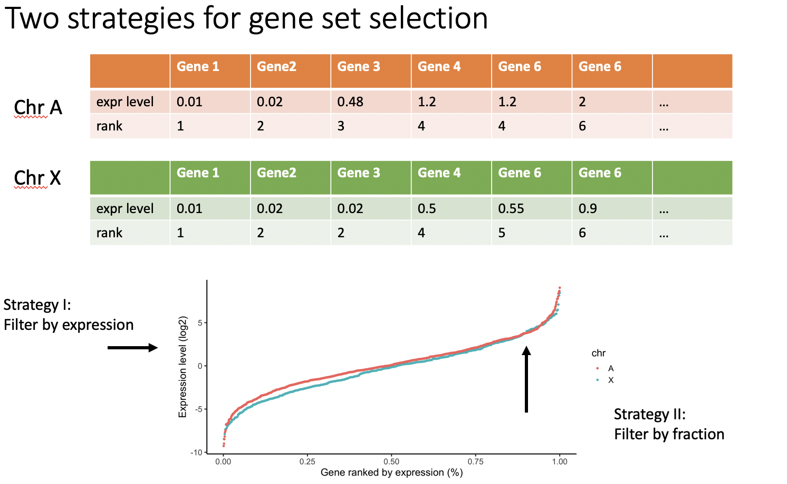
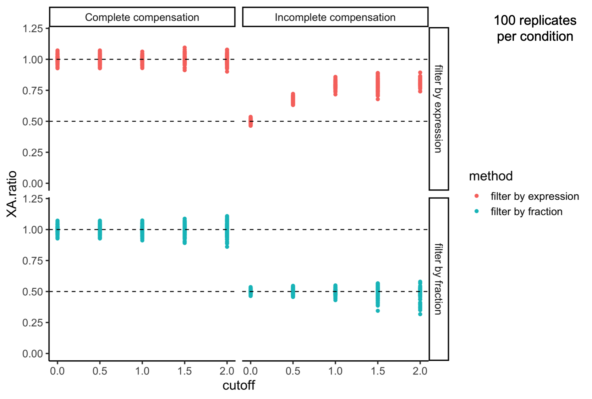

```{r setup, include=FALSE}
knitr::opts_chunk$set(echo = T,message = F,warning = F,
        fig.width=6,fig.height=4,cache = TRUE,
        #fig.show='hold',
        fig.align='center')

knitr::opts_knit$set(root.dir = getwd())
options(stringsAsFactors = F)
```

```{r}
# load R libraries
suppressPackageStartupMessages({
  # Analysis
  library(data.table)
  library(dplyr)
  library(Seurat)
  library(scran)
  library(SingleCellExperiment)
  library(SummarizedExperiment)
  library(parallel) #for mclapply function
  # Plotting
  library(ggplot2);library(gridExtra)
  library(RColorBrewer)
})

```

#  Overview

- Workflow
  + gene chromosome position information extraction
  + denoise expression matrix 
  + calculate XA ratio using `filter_by_frac_xa_ratio` or `filter_by_expr_xa_ratio`

- Dataset
  + The tested dataset is fly embryo single-cell data, from [Calderon, Diego, et al. "The continuum of Drosophila embryonic development at single-cell resolution." Science 377.6606 (2022): eabn5800](https://www.science.org/doi/10.1126/science.abn5800) can be assessed from [website](https://shendure-web.gs.washington.edu/content/members/DEAP_website/public/).
  + Rds object `18_20_finished_processing.rds` was downloaded from [link]( https://shendure-web.gs.washington.edu/content/members/DEAP_website/public/RNA/update/seurat_objects/pred_windows/NNv1/) and used in this document.


# gene chromosome position information extraction 

- use R package `biomaRt` to extract chromosome location of each fly genes
- use R package `AnnotationDbi` and `org.Dm.eg.db` to link gene's FLYBASE id and gene symbols.

```{r eval=FALSE}
#1) biomaRt 
library(biomaRt)
packageVersion("biomaRt") #‘2.50.3’

biolist <- as.data.frame(listMarts())
ensembl=useMart("ensembl")
esemblist <- as.data.frame(listDatasets(ensembl))
esemblist[grep('melanogaster',esemblist$description),]
#dataset                              description  version
#56 dmelanogaster_gene_ensembl Drosophila melanogaster genes (BDGP6.32) BDGP6.32

ensembl = useDataset("dmelanogaster_gene_ensembl",mart=ensembl)
filters = listFilters(ensembl)
attributes = listAttributes(ensembl)

attributes[grep('dmel',attributes$name),]
grep('transcript',attributes$name,value=TRUE,ignore.case = TRUE)

t2g<-getBM(attributes=c('ensembl_gene_id','chromosome_name','start_position','end_position',
        'ensembl_transcript_id','flybase_transcript_id',
        "transcript_start", "transcript_end",
        'transcription_start_site', "transcript_length","transcript_count"), mart = ensembl)
dim(t2g) #41209    11
saveRDS(t2g,'t2g_chr.coord.rds')

df.t2g=t2g[!duplicated(t2g$ensembl_gene_id),]
dim(df.t2g) #23932

#2) AnnotationDbi and org.Dm.eg.db
x=readRDS('~/Documents/Data_Jay_fly_development/SupplementaryOnlineMaterial/seurat_objects/pred_windows/NNv1/18_20_finished_processing.rds')

expr.mat=x@assays$RNA@counts
gene.names=rownames(x)
length(gene.names) #23932

# validate gene id
library(AnnotationDbi)
library(org.Dm.eg.db)
package.version("AnnotationDbi") #"1.56.2"
package.version("org.Dm.eg.db") # "3.14.0"

test.out=select(org.Dm.eg.db, keys=gene.names, keytype="SYMBOL",
                columns=c("SYMBOL","GENENAME",'FLYBASE') )
dim(test.out) #23932     3

sum(is.na(test.out$FLYBASE))#6101
keep=test.out[!is.na(test.out$FLYBASE),] #17831 genes
sum(duplicated(keep$FLYBASE)) # 0 duplicated FBgnxxx.

gene.meta=keep

sum(gene.meta$FLYBASE %in% df.t2g$ensembl_gene_id) #17831 overlap
gene.meta[!gene.meta$FLYBASE %in% df.t2g$ensembl_gene_id,] #none
df.gene.meta=merge(gene.meta,df.t2g,by.x='FLYBASE',by.y='ensembl_gene_id',all.x=T)
dim(df.gene.meta) #17831 genes

data.table::fwrite(df.gene.meta,'validated_17831genes.txt')
```

# denoise expression matrix 

Considering the high sparsity and the existence of uncertainly in measuring gene expression with single-cell data, we implemented a `denoise` pipeline to assign a confidence score to each element in the original gene expression matrix and apply a confidence socre cutoff value to remove `noisy` elements.

Pipeline:



The `denoise()` function takes a UMI count matrix and a confidence score cutoff (0~1) as inputs.
After fitting a mixture model to each gene separately, it assigns a confidence score to each matrix element. Based on the user-specified confidence cutoff, a denoised matrix is generate.

`source('denoise.R')` to perform the denoise.

```{r}
source('denoise.R')
x=readRDS('~/Documents/Data_Jay_fly_development/SupplementaryOnlineMaterial/seurat_objects/pred_windows/NNv1/18_20_finished_processing.rds')
table(x$seurat_clusters) # cell# per cluster

test=x[,x$seurat_clusters=='17'];
input.mat=test@assays$RNA@counts #get umi count matrix
cell.meta=test@meta.data; #annotation information for each cell

gene.meta=data.table::fread('validated_17831genes.txt')  #from the previous step
start_time <- Sys.time()
res_out=denoise(input.mat=input.mat,conf.cutoff=0.999,gene.meta=gene.meta,ncores=1)
end_time <- Sys.time()
end_time-start_time # ncores=1, 360 cells takes 48secs
names(res_out);
denoise.mat=res_out$denoised.mat
```

# calculate XA ratio using `filter_by_frac_xa_ratio` or `filter_by_expr_xa_ratio`

In general, there are two strategies to calculate XA ratio per cell:
- filter_by_fraction
- filter_by_expression


A simulation experiment showed that `filter_by_fraction` behaves more stable in either complete-compensation or incomplete-compensation scenario, while `filter_by_expression` tend to overestiamte the XA ratio in incomplete-compensation scenario.



We implemented both strategies via function: `filter_by_frac_xa_ratio` and `filter_by_expr_xa_ratio` in the `calculate_XAratio.R` script. 

These two functions both requirement 3 input parameters:

- cutoff: gene expression level above this cutoff would be retained as expressed gene.
- x_expr: X-linked genes expression vector
- a_expr: autosomal genes expression vector

Each function returns a vector: c('XAratio','ngeneX','ngeneA')

- XAratio: the estiamted XA ratio value
- ngeneX: the number of X-linked genes used in calculating the ratio
- ngeneA: the number of autosomal genes used in calculating the ratio


`source('calculate_XAratio.R')` to load these two functions.

```{r}
source('calculate_XAratio.R')

# read in gene.meta info which contains chr info
gene.meta=data.table::fread('validated_17831genes.txt')
X=gene.meta[gene.meta$chromosome_name=='X',]$SYMBOL
autosomal=gene.meta[gene.meta$chromosome_name %in% c('2L','2R','3L','3R','4'),]$SYMBOL

cutoff=1; # gene expression level above cutoff would be retained as expressed gene.
expr.mat=denoise.mat; #denoise.mat from the previous step
#expr.mat=input.mat; #or use umi count matrix as input directly
  
n.expr.gene=Matrix::colSums(expr.mat>0,na.rm=T)
test.mat=expr.mat[,n.expr.gene>=100] #retain cells that expr >=100 gene
test.meta=cell.meta[n.expr.gene>=100,]

res<-mclapply(1:ncol(test.mat), #mclapply from parallel R package
              mc.cores=8,function(i){
                gene.expr=test.mat[,i]
                gene.expr=gene.expr[which(gene.expr!=0)]
                #summary(gene.expr)
                real.X.genes=names(gene.expr)[names(gene.expr) %in% X]
                real.X=gene.expr[real.X.genes]
                all.A=gene.expr[names(gene.expr) %in% autosomal]
                if(length(real.X)==0|length(all.A)==0){return(c(NA,NA,NA))}
                filter_by_frac_xa_ratio(cutoff=cutoff,x_expr=real.X,a_expr=all.A)
                #filter_by_expr_xa_ratio(cutoff=cutoff,x_expr=real.X,a_expr=all.A)
                
              })
df.res=as.data.frame(Reduce(`rbind`,res))
colnames(df.res)<-c('XAratio','ngeneX','ngeneA')

# combine cell.meta information
df.res=cbind(df.res,test.meta) # ncell x attributes matrix
saveRDS(df.res,'test_XAratio.rds')

# plot cells which express >=20 X-linked genes and autosomal genes
ggplot(subset(df.res,ngeneX>=20 & ngeneA>=20),aes(x=seurat_clusters,y=XAratio,group=seurat_clusters,col=seurat_clusters))+
  geom_violin()+theme_classic()+geom_jitter(size=0.1)+
  stat_summary(fun = "median", colour = "red", size = 2, geom = "point")
```

You can also directly compute XAratio using the UMI count matrix. This is preferred if gene expressions of the transformed UMI count matrix, i.e., log(1+CPM), didn't follow mixture distribution.

```{r}
source('calculate_XAratio.R')

# read in gene.meta info which contains chr info
gene.meta=data.table::fread('validated_17831genes.txt')
X=gene.meta[gene.meta$chromosome_name=='X',]$SYMBOL
autosomal=gene.meta[gene.meta$chromosome_name %in% c('2L','2R','3L','3R','4'),]$SYMBOL

cutoff=1; # gene expression level above cutoff would be retained as expressed gene.
expr.mat=input.mat; #or use umi count matrix as input directly
  
n.expr.gene=Matrix::colSums(expr.mat>0,na.rm=T)
test.mat=expr.mat[,n.expr.gene>=100] #retain cells that expr >=100 gene
test.meta=cell.meta[n.expr.gene>=100,]

res<-mclapply(1:ncol(test.mat), #mclapply from parallel R package
              mc.cores=8,function(i){
                gene.expr=test.mat[,i]
                gene.expr=gene.expr[which(gene.expr!=0)]
                #summary(gene.expr)
                real.X.genes=names(gene.expr)[names(gene.expr) %in% X]
                real.X=gene.expr[real.X.genes]
                all.A=gene.expr[names(gene.expr) %in% autosomal]
                if(length(real.X)==0|length(all.A)==0){return(c(NA,NA,NA))}
                filter_by_frac_xa_ratio(cutoff=cutoff,x_expr=real.X,a_expr=all.A)
                #filter_by_expr_xa_ratio(cutoff=cutoff,x_expr=real.X,a_expr=all.A)
                
              })
df.res=as.data.frame(Reduce(`rbind`,res))
colnames(df.res)<-c('XAratio','ngeneX','ngeneA')

# combine cell.meta information
df.res=cbind(df.res,test.meta) # ncell x attributes matrix
saveRDS(df.res,'test_XAratio_umi.rds')

# plot cells which express >=20 X-linked genes and autosomal genes
ggplot(subset(df.res,ngeneX>=20 & ngeneA>=20),aes(x=seurat_clusters,y=XAratio,group=seurat_clusters,col=seurat_clusters))+
  geom_violin()+theme_classic()+geom_jitter(size=0.1)+
  stat_summary(fun = "median", colour = "red", size = 2, geom = "point")
```

```{r}
sessionInfo()
```
